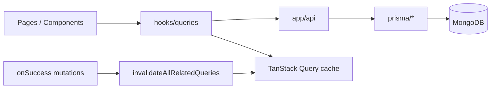
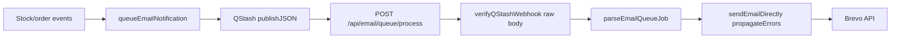

# PROJECT_WALKTHROUGH.md

Agent-oriented map of **stock-inventory** (Stockly). Last updated: 2026-07-31 (REQ-0224 densify parity).

## 1. What this app is

Role-based inventory platform (admin / supplier / client): products, orders, invoices, warehouses, support tickets, Stripe, Shippo, Brevo, optional Redis cache and Sentry monitoring.

**Live:** <https://stockly-inventory.vercel.app/>

## 2. Repo map (high level)

```bash
app/              → pages + app/api/* route handlers
components/       → UI (ui/, Pages/, admin/, shared/, providers/)
hooks/queries/    → TanStack Query hooks + mutations
contexts/         → auth context
lib/              → api, auth, cache, email, monitoring, react-query, server, validations
prisma/           → schema + data access helpers
types/            → shared TS types
instrumentation.ts + instrumentation-client.ts → Sentry + Redis/QStash boot
```

## 3. Request & state flow



- **Reads:** query hooks → `lib/api` client → API routes → Prisma
- **Writes:** mutations → API → `await scheduleInvalidate*()` before 200 → client `invalidateAllRelatedQueries` / `invalidateAfterCatalogChange` / order-graph extensions
- **Deletes:** `cancelOrRemoveDetailQuery` then broad invalidation (no refetch 404 while detail page mounted)
- **Prefetch / persistence:** `lib/react-query/provider.tsx`, keys in `config.ts`

## 4. Product delete (implemented)

| Case | API | UI |
|------|-----|-----|
| Shipped/pending order | 409 + message | Toast shows error |
| Delivered/cancelled only | 200 `{ mode: "soft" }` | Archived toast; hidden from lists |
| Never ordered | 200 `{ mode: "hard" }` | Removed from DB |

- Filter: `lib/products/product-query.ts` → `deletedAt` null OR unset (legacy MongoDB rows)
- Tests: `npm run test` (delete-policy, prisma-errors, imagekit-errors)

## 5. Sentry monitoring (implemented)

| Layer    | File                                                          | Role                                                          |
| -------- | ------------------------------------------------------------- | ------------------------------------------------------------- |
| Config   | `lib/monitoring/sentry-config.ts`                             | DSN, tunnel `/api/monitoring`, scrubbing, sample rates        |
| Wrappers | `lib/monitoring/sentry.ts`                                    | `captureException`, `captureMessage`, user/breadcrumb helpers |
| Client   | `instrumentation-client.ts`                                   | `Sentry.init`, replay, browser tracing, tunnel                |
| Server   | `sentry.server.config.ts`                                     | Node/API/SSR                                                  |
| Edge     | `sentry.edge.config.ts`                                       | Edge runtime (if used)                                        |
| Boot     | `instrumentation.ts`                                          | Loads server/edge config; `onRequestError`                    |
| Build    | `next.config.ts`                                              | `withSentryConfig`, `tunnelRoute: /api/monitoring`            |
| Errors   | `app/global-error.tsx`, `components/shared/ErrorBoundary.tsx` | Uncaught + React errors                                       |
| API      | `lib/api/response-helpers.ts`                                 | 5xx → Sentry; 4xx → `logger.warn` only                        |
| Logs     | `lib/logger.ts`                                               | 5xx → Sentry; Axios 4xx skipped (`isExpectedClientError`)     |
| Errors   | `lib/api/errors.ts`                                           | `getErrorHttpStatus`, `isExpectedClientError`                 |

**Verification checklist (manual):**

1. `NEXT_PUBLIC_SENTRY_DSN` + `SENTRY_DSN` set on Vercel → redeploy production
2. Browse prod site → Network tab shows POSTs to `/api/monitoring` (not blocked ingest host)
3. Sentry project **stock-inventory** → Issues / Performance show events within ~5 min

**User context:** `contexts/auth-context.tsx` calls `syncSentryUserFromAuth` on session (id, email, role tag).

**Browser Translate + Radix portal noise:** `isBrowserTranslationRemoveChildError` drops translate `removeChild`; `isRadixPortalRemoveChildSentryEvent` drops Radix `SelectPortal` nav races (Safari + Chrome). `ErrorBoundary` silent-recovers via `isRadixPortalRemoveChildError`. Optional `NEXT_PUBLIC_DISABLE_BROWSER_TRANSLATE=true` → `translate="no"` on `<html>` (`app/layout.tsx`). Tests: `lib/monitoring/sentry-config.test.ts`.

**Wizard artifacts:** `.env.sentry-build-plugin` (gitignored) for local source map upload; `sentry.client.config.ts` is compatibility stub only.

## 6. Other optional integrations

| Service | Lib / entry                            | Env (optional)                  |
| ------- | -------------------------------------- | ------------------------------- |
| Redis   | `lib/cache/redis.ts`, `cache-utils.ts` | `UPSTASH_REDIS_*`               |
| QStash  | `lib/queue/qstash.ts`, `lib/queue/qstash-webhook.ts` | `QSTASH_*` (incl. signing keys) |
| Email   | `lib/email/queue.ts` → webhook `app/api/email/queue/process/route.ts` | `BREVO_*`, `NEXT_PUBLIC_API_URL` |
| Stripe  | `lib/stripe/`                          | `STRIPE_*`                      |
| PostHog | Not implemented                        | See integration guide checklist |

Details: `docs/Redis_Sentry_PostHog_INTEGRATION_GUIDE.md`

## 7. TanStack invalidation (2026-05-19)

| Piece | File |
|-------|------|
| Query keys | `lib/react-query/config.ts` |
| Broad invalidation | `lib/react-query/invalidate-all.ts` — `lists()` for catalog entities; `.all` for invoices, reviews, tickets, history, portal, etc. |
| Safe delete cleanup | `lib/react-query/cancel-or-remove-detail.ts` — used by all 9 delete hooks |
| Static audit | `lib/react-query/invalidate-coverage.test.ts` — run `npm run test:invalidate` |
| Server Redis | `lib/cache/post-mutation.ts` — per-domain `scheduleInvalidate*Caches()` via `after()`; `scheduleInvalidateAllServerCaches` escape hatch only |

**Rules:** new mutation hook → `invalidateAllRelatedQueries` on success. New API write → scoped `scheduleInvalidate*Caches()` from `post-mutation.ts` (warehouse/stock/product/category/supplier/order graph). Never `await` full Redis wipe before response.

**Exempt webhooks (no Redis/TanStack):** `app/api/email/queue/process/route.ts`, auth, AI insights, shipping rates, notifications POST — see `API_WRITE_EXEMPT` in invalidate-coverage test.

### Instant UI (REQ-0122–0124)

| Piece | File |
|-------|------|
| Patch helpers | `lib/react-query/patch-mutation-cache.ts` — `patchDetailCache`, `patchListCaches`, `patchOrderGraphListCaches`, `patchProductInPortalCaches`, stock allocation helpers |
| Loading predicates | `lib/react-query/is-data-slot-loading.ts` — `isDataSlotLoading` (cold), `isDataSlotUnsettled` (stale refetch on aggregates) |
| SSR sync guard | `lib/react-query/ssr-sync-policy.ts` — Fix A: no apply while invalidated; idle badges only if `serverAt > cachedAt`; Fix B: `applyDensifyOnly` + merge helpers |
| Mutation pattern | patch detail + list caches **before** `invalidateAllRelatedQueries` / `invalidateAfterOrderGraphChange` |
| Domains patched | products/categories/suppliers/warehouses, orders/invoices (+ client variants), portal browse, support tickets, product reviews, user management |
| Intentional pulse-only | dashboard/home KPI counts (server aggregates); stock transfer (multi-warehouse — invalidate + pulse) |

### Support tickets + dialogs (REQ-0185–0202)

| Piece | Location |
|-------|----------|
| List/detail | densify + chat + GlassCard pad (0185–0196) |
| Related product | owner-scoped `GET /api/support-tickets/owner-products`; densify create/edit/detail (0200–0201) |
| Dialog UX | same-route DeferredSelect; Combobox modal; `useSyncDialogOpenState` (0198–0199) |
| Reassign / Reply | clear mismatched productId; `resolveTicketReplyTarget` (0197) |
| No-flicker | SelectValue SSR labels; `serverHasRicherDensify` sync (0202) |

**Stopped 2026-07-27:** REQ-0136 SSR Fix A/B + idle + statusAt + hydration (`db0bacf`). **Next:** prod smoke → Sentry 24h (REQ-0009) → Gate 2.

## 7b. Table pagination Select (Radix portal, 2026-05-22)

| Piece | File |
|-------|------|
| Defer hook | `hooks/use-deferred-radix-select.ts` |
| Reusable gate | `components/shared/DeferredSelectGate.tsx` (LoginPage, filter toolbars, admin detail pages, form dialogs with `enabled={open}`, shipping dialog) |
| Page-size UI | `components/shared/PaginationSelector.tsx`, `pagination-select-styles.ts` |
| Consumers | All `*Table.tsx` footers (`variant` + `enabled={!isLoading}`) |

Prevents `NotFoundError: removeChild` when App Router navigates between pages while a Radix `SelectPortal` is active (Sentry: `/orders` after `/products`). Rows-per-page change resets `pageIndex` to 0. Filter/search shrink uses `hooks/use-clamp-pagination-index.ts` to clamp `pageIndex` to the last valid page.

## 7d. Validation + 4xx Sentry guard (REQ-0010/0011, 2026-05-19)

| Piece | File |
|-------|------|
| Product body schemas | `lib/validations/product.ts` — `createProductBodySchema`, `updateProductBodySchema`, `productFormSubmitSchema` |
| Catalog body schemas | `lib/validations/{category,supplier,warehouse}.ts` — `*BodySchema` for POST/PUT |
| Products API | `app/api/products/route.ts` — POST/PUT `safeParse`, `logger.warn` on validation fail |
| Catalog APIs | `app/api/{categories,suppliers,warehouses}/route.ts` — same pattern (REQ-0012) |
| API error barrel | `lib/api/index.ts` — `getErrorHttpStatus`, `isExpectedClientError` |
| Sentry audit | `docs/SENTRY_ERRORS.md` — historical cases + fix status |
| Client form | `components/products/ProductFormDialog.tsx` — unified Zod submit |
| Invoice UX | `hooks/queries/use-invoices.ts` — 409 toast |
| OAuth deny | `app/api/auth/oauth/google/callback/route.ts` — silent `access_denied` |
| Payment/shipping schemas | `lib/validations/{payment,shipping}.ts` — checkout, rates, labels, tracking |
| Notification/AI/config | `lib/validations/{notification,ai,system-config}.ts` |
| Auth safeParse | `loginSchema` / `registerSchema` — no `.parse()` throw to 500 |
| Tests | `lib/validations/*-api.test.ts` (296 unit tests) |

**Out of scope:** webhooks (Stripe/Shippo/QStash), multipart product image upload.

## 7e. Sentry production fixes (2026-05-19)

| Issue | Implementation |
|-------|----------------|
| OpenRouter 402 → Sentry 502 | `lib/ai/create-chat-completion.ts` (OpenRouter → Groq chain in `groq.ts`); `GROQ_MODEL_CHAIN` fast-first failover (REQ-0018) |
| Groq chain (REQ-0018) | `lib/ai/groq.ts` — `gpt-oss-20b` → `qwen3.6-27b` → `gpt-oss-120b`; deprecated llama remap; `reasoning_format: hidden` |
| OAuth `User_username_key` | `lib/auth/unique-username.ts`; `createGoogleOAuthUser` + P2002 recovery in Google callback |
| Hydration on `/` | Root `force-dynamic` + SSR props in `app/page.tsx` (no route Suspense); `CategoryList` always mounts `CategoryFilters` (`DeferredSelectGate`) |
| Filter/login/dialog Selects | `DeferredSelectGate` on status/view Selects, `LoginPage`, order/product/invoice/support dialogs, admin form dialogs |
| Admin dashboard hydration (REQ-0019) | `formatStableCurrency` + `formatStableCompactDateTime` (UTC) in `AdminAnalyticsContent`; `LLM_INSIGHTS_MAX_TOKENS=512` in forecasting route; cache key `forecasting:summary:v2` |
| Locale-aware admin (REQ-0020) | `lib/format/client-locale.ts` + `ClientFormatDisplay.tsx`; browser local TZ/currency after mount on admin dashboard + my-activity |
| Shell-first nav (REQ-0021) | `DataSlotPulse` + `isDataSlotLoading` / `isDataSlotUnsettled`; `page.tsx` Suspense shell + streamed SSR; hooks `initialData`; tables keep headers, body pulses; REQ-0122+ patch-then-invalidate |
| Supplier catalog detail (REQ-0029) | `lib/server/catalog-entity-access.ts`; supplier read-only `/categories/[id]` + `/suppliers/[id]` via product links; scoped Redis `detail(id, supplier:{entityId})`; `disableCrud` on detail pages |
| Auth login/register (REQ-0030–0033) | `components/auth/*` — `AuthPageShell`, flat left list, `AuthFormCard` glass, `LoginRoleSelect`; copy in `auth-panel-copy.ts`; `.auth-page-root` document scroll; no TanStack changes |
| Scroll-lock no shift (REQ-0216) | `globals.css` — auth-only html gutter + unlayered `html body[data-scroll-locked]` pad cancel (beats RemoveScroll); CSS-only |
| Empty Select copy (REQ-0217) | `select-empty-copy` + `SelectEmptyContent`; ProductForm Category/Supplier + Transfer dest; presentational |
| Catalog densify parity (REQ-0218) | merge-patch detail; transfer + summary + list productCount; densify keys; deferred KPI/forecast/cross-entity insights |
| findCachedAllocation QueryKey (REQ-0219) | `QueryKey[]` for product+warehouse keys — Vercel tsc unblock |
| Detail Back soft-nav flash (REQ-0220) | navigate then list-safe invalidate; no detail/forecast/stock refetch on leave |
| Densify gateway (REQ-0221) | parties/audit/reserved/allocate enrich/insights no-pulse; patch → invalidate |
| Payment settle densify (REQ-0222) | `patchCommittedAfterOrderMoneySettle` on Stripe return + invoice money; checkout create invalidate-only |
| UI polish (REQ-0223) | single datepicker icon; urgent DenseCatalog; date densify-first; BI chart top margin |
| Densify parity (REQ-0224) | portal recentOrders/lowStock SSR; invoice Order # restack; BI forecast/alerts/warehouse type |
| Auth session toasts (REQ-0034) | `AuthSessionToasts` + `post-login-welcome.ts` / `post-logout-goodbye.ts`; `Toaster` before consumer in `app/layout.tsx`; welcome on `/` `/client` `/supplier`; goodbye on `/login` |
| Auth OAuth welcome (REQ-0035) | `AuthSessionToasts` detects `oauth_success`; `refreshSession` + shared welcome copy; URL strip via `oauth-success-url.ts` |
| App shell full bleed (REQ-0036) | `lib/ui/shell-layout-styles.ts` — `APP_SHELL_WIDTH_CLASS` / `APP_SHELL_DETAIL_CLASS`; Navbar/Footer + 11 lists + 6 details (legacy `SidebarLayout` removed REQ-0069); auth stays `max-w-7xl` in `AuthPageShell`; `9xl` token removed |
| Product status filter glass (REQ-0037) | `ProductStatusFilter.tsx` — `ProductStockStatusBadge` in dropdown rows (matches invoice/order filter pattern; closes REQ-0028 AC7 gap) |
| SafeImage rollout (REQ-0038) | `components/ui/safe-image.tsx` + `safe-avatar-image.tsx`; migrated product/avatar/QR/auth image consumers; native img fallback on optimizer failure |
| Catalog filter UI (REQ-0041–0043) | `lib/ui/catalog-filter-tokens.ts`, `filter-chip-styles.ts`; `CatalogActiveInactiveSelect`, `ActiveInactiveFilterChips`, `DismissibleFilterChips`, `ExportMenuButton`; wired category/supplier/warehouse/products/orders/invoices/reviews/tickets/history/users filters; X hover rose, Reset sky + RotateCcw; no TanStack/invalidation changes |
| Typography scale (REQ-0044) | `lib/ui/typography-scale.ts` — PAGE/CARD/SUBTITLE/STAT tokens; hubs + ~50-file sweep; zero `text-xl`; all `text-lg` paired `text-sm sm:text-lg`; CSS-only — no TanStack/SSR/invalidation |
| Filter row + invoice status (REQ-0045) | `filter-command-item.tsx` — whole-row cmdk toggle; invoice status client-side in `InvoiceTable`/`InvoiceFilters` (matches orders); `shell-layout-styles` header spacing; no TanStack/invalidation delta |
| Catalog toolbar parity (REQ-0046) | `CATALOG_TOOLBAR_TRIGGER_LAYOUT` + `focus-ring-styles.ts` (`GLASS_FOCUS_RING`) — filter/export `px-4 gap-2 h-10 sm:w-auto`; dialog forms via `dialog-form-field.ts`; no focus border shift; dark hue rings; CSS-only |
| Glass button tokens (REQ-0047) | `glass-button-styles.ts` — `GLASS_PRIMARY/ACTION/GHOST_BUTTON` + icon hover; Batch A (payment/shipping/api-status/insights/email-prefs/system-config) + Batch B dialogs/auth; builds on focus-ring; CSS-only |
| Auth light mode + dialog tables + order thumbs (REQ-0048) | `AUTH_FORM_FIELD_*` + `AUTH_GOOGLE_BUTTON`; `DIALOG_TABLE_*` in category/supplier dialogs; `ProductOptionRow` in OrderDialog; CSS/UI only |
| Dialog UX polish (REQ-0049) | dual-theme `DIALOG_TABLE_*`; slim dialog columns; `GLASS_BUTTON_SHELL_RESET` + PRIMARY CTAs; submit validity gates on catalog/product/warehouse dialogs; CSS/UI only |
| Glass shell-reset polish (REQ-0050) | `DIALOG_TABLE_SECTION_TITLE`; Batch B primary buttons shell-reset; review dialog amber submits; CSS/UI only |
| CTA hotfix (`73060a1`) | `AUTH_SUBMIT_BUTTON_EMERALD`; SHELL_RESET shadow-only; auth + page primary CTAs restored |
| REQ-0051 backlog | detail-page CTAs, FABs, ShippingManagement, WriteEditReview cancel — planned |

Tests: `lib/ai/openrouter.test.ts`, `lib/ai/groq.test.ts`, `lib/ai/create-chat-completion.test.ts`, `lib/auth/unique-username.test.ts`, `lib/server/catalog-entity-access.test.ts`.

## 7f. Home route SSR (no Suspense, 2026-05-19)

| Piece | File / behavior |
|-------|-----------------|
| Server page | [`app/page.tsx`](app/page.tsx) — session, role redirects, `getProductsForUser` + categories + suppliers |
| OAuth flag | `searchParams.oauth_success` → `initialOAuthSuccess` (same pattern as `ownerId` on products page) |
| Client page | [`components/Pages/HomePage.tsx`](components/Pages/HomePage.tsx) — RQ hydrate, OAuth refresh, URL cleanup via `history.replaceState` |
| No Suspense | Avoids 50vh pulse fallback; relies on layout `force-dynamic` |

**Manual:** hard refresh `/` (instant store overview); Google OAuth lands on `/` with lists populated.

## 7c. QStash email queue (2026-05-19)



- **Fix:** request body consumed once (`text()` → verify → `JSON.parse`); fixes Sentry `Body has already been read`
- **Security:** `Receiver.verify` with `QSTASH_CURRENT_SIGNING_KEY` / `QSTASH_NEXT_SIGNING_KEY`
- **Retries:** webhook 500 on send failure → QStash retries; direct fallback in `queueEmailNotification` still logs-only on error

## 7h. Post-mutation cache + order/invoice UX (REQ-0052–0062, 2026-07-11)

| Area | Pattern |
|------|---------|
| Redis invalidation | `lib/cache/post-mutation.ts` — domain `scheduleInvalidate*()` **awaited before** API 200/201 (no stale refetch race) |
| TanStack | mutations → `invalidateAllRelatedQueries` / `invalidateAfterOrderGraphChange`; delete → `cancelOrRemoveDetailQuery` first |
| Back nav | `useBackWithRefresh` on all 9 detail entities — invalidates before `router.back` / list push |
| CopyableText | `components/shared/CopyableText.tsx` — order/invoice # in tables, detail headers, portals |
| ProductThumb | `ProductOptionRow` extract; `imageUrl` on order detail items + warehouse allocations + catalog grids |
| OrderPickerCommand | searchable order select in `InvoiceDialog` create mode; `initialOrderId` pre-select |
| Cross-domain menus | `invoiceForOrder` on order lists (`getInvoiceLinkMap` batch); invoice actions in `OrderActions`; View/Cancel order in `InvoiceActions` |
| Invoice line items | REQ-0063 — `linkedOrderItems` + `ProductLineItemsList` on invoice detail; `mapOrderItemsFromRaw` shared mapper |
| Shipping copy | REQ-0063 — `CopyableText` on order#/tracking in `ShippingManagement` + `OrderTrackingInfo` |
| Warehouse integration (REQ-0066) | transfers, dialogs, SSR, order sync; AC6: dialog shell parity, `StockQuantityField`, `DialogSubmitButton`, FAB restore, SSR→TanStack stock sync, `stock-allocation-enrich` |
| SSR cache sync + submit UX (REQ-0069) | `useSyncSsrQueryData` on all detail + primary list pages; `useBackWithRefresh` stock invalidation; `DialogSubmitButton` sweep; enrich tests; orphan shell deleted |
| SSR sync completion (REQ-0070) | Client browse + portal pages; admin lists/activity/analytics; `useSyncSsrQueryDataMany` adoption; hook fingerprint hardening; SidebarLayout doc scrub |
| Portal & detail UX (REQ-0071/0072) | PageSectionHeader portals; `glassDetailFooterButtonClass`; `DetailInfoRow`; Stripe back; `enrichOrderItemsCatalogNames`; REQ-0072 admin/header/catalog sweep |
| Portal/browse/order UX (REQ-0073) | Portal header gap; CARD_LIST recent cards; owner avatars; FAB click-toggle; line-item layout; order paidAt; detail icon parity |
| Portal/chart/detail parity (REQ-0074) | pb-6 rhythm; chart point labels; FAB hover; order dialog grid; PartiesRolesCard; InvoiceSummaryCard |
| Supplier UI sweep (REQ-0075) | product-stock owner scope; supplier invoice SSR/API; role gating; admin/static header parity |
| REQ-0075 gap closure (REQ-0076) | SectionCardHeader inner sections; admin DetailInfoRow; supplier Pay gate; invoices-data test; dead prefetch trim |
| Chart/portal/product UX (REQ-0077) | Chart labels; catalog meta badges; AvatarInlineLink; CopyableText; product detail enrichment; glass back; gap closure |
| Badge hydration (REQ-0078) | `SectionTitleRow` — Badge as sibling not inside p/h3; ClientPortal + ProductReviews + ProductDetail |
| Client UI polish (REQ-0079) | `SectionCountBadge`, `ListIndexBadge`; font-normal catalog links; supplier avatars; detail gap-6 spacing; recent orders polish |
| Stat badge gap closure (REQ-0080) | StatisticsCard neutral sub-badges; slate-only section counters; list header pb-6 dedupe; GlassCard padding revert |
| Category detail parity (REQ-0081) | OwnerPickerRow; CategoryDetail DetailInfoRow + charts; SSR insights/forecast; product/order row enrichment |
| Category gap closure (REQ-0082) | CopyableText h1; ChartBarLabel; cache-read forecast; TanStack fallback |
| Category forecast shell (REQ-0083) | Urgent table TableBodyPulseRows; admin `/categories/[id]` cache-read forecast SSR |
| Detail insights parity (REQ-0084) | Product/supplier/warehouse insights charts; forecast SSR sync; CatalogInsightsSection |
| Insights lib hygiene (REQ-0085) | `lib/insights/*` client-safe compute; Supplier h1 CopyableText; product warehouse pie SSR enrich |
| Detail list UI parity (REQ-0086) | `CatalogDetailProductGrid` + `CatalogDetailRecentOrdersList`; supplier stats/info SSR party enrich |
| List loading DRY (REQ-0087) | Parent pages pass `loading={dataLoading}` to shared catalog list components |
| Demo seed (REQ-0088–0092) | Full catalog seed opt-in; accounts-only reset; Test Supplier naming |
| Warm prefetch (REQ-0093) | `role-nav-config.ts`; batched TanStack warm; staggered `router.prefetch`; filter `enabled` gate |
| Instant nav (REQ-0094) | Navbar `<Link prefetch>`; `getWarmPathsForRole` + `resolveWarmNavPath`; portal detail prefetch; shell hygiene |
| Admin portal UI (REQ-0098) | `semantic-badges` glow badges; Api `GlassCardBody`; QR truncate; dashboard CTAs; portal `AvatarInlineLink` + SSR image; notification dropdown UX |
| Post-0098 gaps (REQ-0099) | `AdminAnalyticsContent` section `gap-6`; supplier portal `userId` + User `image` SSR; dead stock scripts removed |
| Avatar stale-cache (REQ-0100) | `AdminSupplierPortalContent` `seed={userId ?? id}` — no cache-key bump; TTL/invalidation sufficient |
| Stock allocation sync (REQ-0102) | Catalog reconcile on product PUT; `enrichStockAllocationRows` unified API+SSR enrich; warehouse delete guards; archived rows |
| Disjoint reservation (REQ-0103) | `order-stock-reservation.ts`; `committedQuantity` on product lists; catalog floor 20 not 40 |
| committedQuantity parity (REQ-0104) | Category/supplier detail SSR enrich; forecasting card/API; supplier dashboard avail |
| Product detail SSR (REQ-0105) | `product-detail-data.ts` committedQuantity enrich + cache guard; `ProductDetailPage` `getDisplayCommittedQuantity`; project notes in `.cursor/rules/project-quick-reference.mdc` |
| Order stock UX (REQ-0106–0109) | Auto-assign greedy pick; catalog cap; product allocation summary; live reconcile preview; feedback layout tokens |
| Stock gap closure (REQ-0110) | committedQty order cap; `prefetchStockByProduct`; `getAllocationQtyBounds`; dialog shells + tests |
| Order workflow (REQ-0111) | `useOrderLineStockValidation`; `OrderDialogCreateLineItem`; `ensureStockAllocationsAndValidate`; server message parity |
| Line fetch DRY (REQ-0112) | Single stock fetch per line; injected rows; `lineStockErrors` by `field.id` |
| Warehouse select (REQ-0113) | `OrderLineWarehouseSelect` props-only; `OrderFormData` merged; `.types.ts` deleted |
| Order/Invoice densify (REQ-0187) | Invoice picker/panel; line Subtotal/Warehouse cols; Cat/Sup STATUS; Product Combobox + `DialogWarehouseOptionRow` |
| Stock UX + dialog/UI closure (REQ-0114–0116) | `ProportionalPriceDisplay`; catalog-commit hints; proportional pricing; dialog labels; detail typography | Gates: test 498 |
| Dialog UX parity + admin embed tables (REQ-0117) | `DialogFormLabel` flex-safe; `DialogDateField`/`DialogHeaderBrand`; `AdminEmbedDataTable`; order totals empty state; VS-045 network audit | Gates: test 498 |
| Readable popover full sweep (REQ-0118) | `popover-readability-styles.ts`; PaymentDialog header; all filter/pagination popovers; VS-046 prod network OK | Gates: test 498 |
| REQ-0119 gap closure | Catalog/export popover parity; `OrderAddressFields`; Business Insights Warehouses tab + SSR warehouse summary | Gates: test 504 |
| Detail parity + statusAt (REQ-0127–0129) | `PersonInlineRow`, `RecentOrderStatusColumn`, `order-status-display-date.ts`; invoice `paidAt` → `OrderForPage.statusAt`; portal/dashboard SSR | Gates: test 528 |
| Semantic dates (REQ-0130–0132) | `semantic-date-styles.ts`; `ClientDate*` `semantic` prop; list tables + exports `formatStableDate`; ticket/PDF/script sweep | Gates: test 531 |
| Cache coherence (REQ-0133) | SSR sync skip; Redis pattern widen; persist auth/user; `invalidateAfterCatalogChange`; `setCache` re-warm guard | Gates: test 544 |
| Session + QR idle (REQ-0134) | JWT/cookie 1d; `useSession` focus refetch; product QR second Redis wipe; `gcTime` 30m | |
| Redis pattern close (REQ-0135) | Invoice+stock; portals; enrich; `post-mutation.test.ts` membership; manual §10 | |
| Explore seed (REQ-0137) | `DEMO_CATALOG_SEED`; `--with-catalog`; 1–2 rows/entity | |
| Product UI (REQ-0138–0139) | Table QR/dates; detail 3-col; Catalog Allocation companion; urgency badges | |
| Seed stock + sold (REQ-0140) | Beats `product.reserved=0`; sold=delivered\|paid; insights `qty−committed` | Gates: test 556 |
| Cat/sup UI (REQ-0141–0143) | productCount+% + HelpTooltip; detail · separators; category + invoice on recent orders | |
| Hydration + theme (REQ-0144) | Plain `&` table labels; ThemeProvider script filter; forecasting `gpt-4o-mini` | |
| Orders table (REQ-0145) | Status/Payment/Invoice `SemanticEventDate`; product links; Invoice 2-line; `orders:list:v3` | Gates: test 571 |
| Order detail (REQ-0146–0149) | Density/layout; CarrierGlassBadge; Total+line prices `sm:text-base` / strike `xs–sm`; light header Back + ghost; invoice meta ·; ListIndexBadge dark inverse; `trackingCarrier` write | UI/CSS + carrier field; invalidation unchanged |
| Invoice table (REQ-0150–0151) | Dense columns; linkedOrder status/payment badges; Zod date-only update; due Clock; `invoices:list:v2:` | Invalidation unchanged |
| Partial pay (REQ-0152) | Order unpaid/partial/paid from invoice money; Stripe amount + webhook incremental; PaymentDialog toggle; `PaymentMoneyBreakdown`; `orders:list:v4` | Server sync + UI |
| Instant order patch (REQ-0153) | `patchLinkedOrderFromInvoiceMoney` on invoice create/update/send | Patch → invalidate |
| Order party Self/Client (REQ-0158) | `order-party.ts`; clientId portal; seed 001–004 | create/list/portal/seed |
| Buyer display + Self invoices (REQ-0159) | buyer placedBy/orderedBy; `/invoices` Self-only; `Store ·` client labels; drop dead store list helper; KPIs via `getStoreOrderIds` | display + list scope; invalidation unchanged |
| User overview copy (REQ-0160) | role-aware Overview blurb; My Activity sky tip on own store-owner user detail | copy-only |
| Order/Invoice header help (REQ-0161) | HelpTooltip on dense Order/Invoice column headers | UI-only |
| Invoice detail (REQ-0162–0164) | Order-parity layout; items ORD chip + SSR reviews; compact reviews; party owner links; summary icon hues | UI + SSR review prefetch |
| Detail review + audit (REQ-0165–0167) | Sky party/audit links; eligibility patch; compact rating\|edit-delete row; amber Write glass; dialogTextClass + Cancel ghost | UI + review mutation patch |
| Admin spacing + recent density (REQ-0168–0169) | BI/My Activity gap-6 + shell stats token; healthy reorder copy; ActivityLog mb-4; My Activity Order columns; optional onEdit | UI; invalidation unchanged |
| Portal/dashboard density (REQ-0170) | Clickable Latest-5 + portal recent (avatars/thumbs); Forecasting StatisticsCard+ChartCard | UI + SSR enrich; invalidation unchanged |
| Forecast + Top Products (REQ-0171–0173) | Compact KPIs; `DenseCatalogProductCell`; forecast v4; dashboard overview v2/v7 | SSR enrich; invalidation unchanged |
| Recent cards densify (REQ-0174–0176) | `CARD_LIST_META_ROW`; date-first buyer; gap-1.5; dashboard v7 | Clip fix + UI |
| Admin portals densify (REQ-0177–0178) | SectionCardHeader; product/order/invoice meta; buyer `placedBy*`; Redis supplierPortal v4 / clientPortal v4 | SSR + UI; invalidation unchanged |
| Product reviews (REQ-0179–0184) | Rating Select hues; list densify + Actions menu; detail Product/Purchase; badge contrast; Edit dialog stacked w-full; Redis `productReviews:list:v2` / `products:list:v3` | enrich-review-catalog; invalidation unchanged |
| Supplier Product Owner (REQ-0226) | `PersonNameEmailCell` on supplier `/products`; `productOwnerEmail` list party + cache guards | UI + list DTO; invalidation unchanged |
| Personal tickets scope (REQ-0227) | `/support-tickets` → `created_by_me` key (admin store keeps `all`=assigned) | Fix shared-key leak after create |
| KPI badge helpers (REQ-0156–0157) | store order/invoice + portal order helpers; My Activity parity; tsc clean | UI/test-only |
| Delivered + Due badges (REQ-0155) | `store-order-status-badges.ts`; Total Orders Delivered; Outstanding→Due | UI-only |
| Partial pay KPIs (REQ-0154) | `payment-money-stats.ts` → dashboards Paid/Partial/Due/Pending; Partial badges; table Total `text-xs`; `dashboard:overview:v4` | Invalidation unchanged |
| Tickets densify (REQ-0185–0202) | owner-products; Related densify; dialog open/combobox; SelectValue SSR; densify-richer sync | Invalidation unchanged |
| Next | Gate 2 Sentry 24h (REQ-0009) | tip `db0bacf` |
| Cache/badges/hydration (REQ-0136) | SSR Fix A/B + idle; statusAt updatedAt fallback; invoice statusAt patch; toDateOrNull; ClientRelativeTime suppress | Invalidation unchanged |
| Educational README (REQ-0213) | Learner README + Diploi launch; SECURITY link; 3 required env | Docs-only |
| Deploy unblock (REQ-0212) | Pin `eslint-import-resolver-typescript@3.10.1`; merge items always `OrderItem[]`; Order dates `string\|Date` | No invalidation change |
| Pay/cancel/Shippo (REQ-0209…0211) | Stripe return+confirm; cancel/update/ship→invoice badge patch; SSR fresher badges; item densify merge; Shippo test; draft→sent heal | Order-graph patch→invalidate |
| SECURITY.md (REQ-0207) | Root policy + README link; private reports → contact@arnobmahmud.com | Docs-only |
| Supplier invoices (REQ-0204) | `getInvoiceByIdForSupplier` + detail/PDF gate; Related Invoices nav | Invalidation unchanged |
| Client catalog INV/ORD (REQ-0214) | `getInvoiceByIdForClient` / expanded `getOrderByIdForClient`; Pay buyer-only; Process Refund disabled for client/supplier | Invalidation unchanged |
| Partial→paid settle (REQ-0215) | Cent-safe money; heal sent→paid + order sync; confirm + detail SSR; stripe return patch | Order-graph invalidate unchanged |
| Scroll-lock layout (REQ-0216) | Auth-only gutter + unlayered RemoveScroll pad cancel | CSS-only; no invalidation |
| Empty Select copy (REQ-0217) | Shared "No … found" placeholder + SelectEmptyContent | Presentational |
| Catalog densify (REQ-0218) | Detail merge-patch; transfer/summary/list count patches; densify keys | Patch → invalidate; deferred: KPI/forecast pulse, cross-entity insights |
| findCachedAllocation QueryKey (REQ-0219) | `QueryKey[]` for byProduct + byWarehouse | Typing only; Vercel tsc |
| Detail Back flash (REQ-0220) | `invalidateAfterBackNavigation` + nav-first | Lists/dashboards only on leave |
| Densify gateway (REQ-0221) | committed patch; create densify; audit densify-first; allocate enrich | Patch → invalidate |
| Payment settle (REQ-0222) | settle helper on Stripe invoice/order return + invoice update | Checkout create unchanged |
| UI polish (REQ-0223) | datepicker hub; urgent densify; date densify-first; BI chart margin | No invalidation change |
| Densify parity (REQ-0224) | portal SSR+UI; invoice Order #; BI DenseCatalog; warehouseType | No invalidation change |
| Supplier invoice KPIs (REQ-0205) | `/invoices` SSR portal + 4 StatisticsCards (OrderList parity) | Invalidation unchanged |
| Portal SSR sync (REQ-0206) | `portal.*Dashboard(userId)`; list sync matches hooks (not admin keys) | Invalidation unchanged |
| Sentry noise (REQ-0009) | Order stock warn+disable; warehouse cold-load pulse; tracesSampleRate 0 dev; notif DELETE 404 | Invalidation unchanged |
| Warehouse detail (REQ-0203) | Status trailing; Info\|Stock; muted SKU + meta/actions; Allocate/Transfer densify; DRY `productSupplierImage`/`Id` | Invalidation unchanged |
| Warehouse Type UI (REQ-0186) | Table Type badge + CopyableText + View Details; dialog Select solid/opaque; `getWarehouseTypeLabel` | Invalidation unchanged |
| AI warehouse insights (REQ-0067) | `POST /api/ai/insights` enriches payload with `getWarehouseStockSummary` |
| Per-warehouse order picking (REQ-0068) | `OrderItem.warehouseId`; `stock-allocation-order-sync.ts`; `OrderLineWarehouseSelect`; reserve/fulfill/cancel sync; invoice-paid gap; `f892b65` removed unused `deleteCache`/`getRateLimitStatus` |
| Demo reset | `npm run script:reset-demo-db` — accounts-only (3 users + Test Supplier); opt-in catalog via `seed-demo-catalog` |

**Invalidation on REQ-0058–0062:** no new write routes; existing invoice/order mutation hooks + `INVOICE_PATTERNS` Redis scope already cover UI refresh.

## 7g. Post-deploy observability (REQ-0009)

1. Confirm Vercel production = commit `9a2e37c` (REQ-0013; or later on `main`)
2. Smoke: bell dropdown, create product w/o category (400, no Sentry), duplicate invoice (409 toast)
3. Sentry **stock-inventory** — 24h: compare cases 1–7 vs `docs/SENTRY_ERRORS.md`

## 8. Quality gates (audit 2026-07-26 REQ-0212)

| Check | Status |
|-------|--------|
| `npx tsc --noEmit` | pass |
| `npm run lint` | pass |
| `npm run build` | pass |
| `npm run test:invalidate` | 221 passed |
| Local | REQ-0212 deploy unblock (lock + Order patch TS) |
| Radix table Select | `useDeferredRadixSelect` + `PaginationSelector` (11 tables) |
| Pagination clamp + page-size reset | `useClampPaginationIndex` + `PaginationSelector` pageIndex 0 |
| Sentry | tunnel + translate scrub + `syncSentryUserFromAuth` |
| Browser translate | default allows Translate; optional env blocks |
| Python | N/A |

**Gaps (OK):** optional deferred-select unit test; i18n not implemented (README documents Translate caveat).

**Manual QA:** `/` no Suspense skeleton; soft-delete from product detail (1 DELETE, no GET 404); cross-page list refresh without reload; prod email queue after deploy; `/products` → `/orders` (no removeChild); OAuth `/?oauth_success=true`.

## 9. When changing code

- **New API route:** `successResponse` / `errorResponse`; server cache invalidation on writes
- **New mutation hook:** `invalidateAllRelatedQueries`; delete → `cancelOrRemoveDetailQuery` first
- **New API write route:** add to `API_WRITE_ROUTE_INVALIDATION_SPEC` in invalidate-coverage test (or exempt list)
- **Sentry:** `SENTRY_TUNNEL_PATH` in sync (`sentry-config.ts`, `next.config.ts`)
- **Env:** update `.env.example` + `.cursor/rules/project-quick-reference.mdc` + this file
- **Dates:** UI → `ClientDate*` + `semantic`; export/PDF → `formatStableDate`
- **Cache coherence (REQ-0133):** SSR sync skip; Redis `__invAt` re-warm guard; catalog CRUD → `invalidateAfterCatalogChange`; persist auth/user only
- **Session (REQ-0134):** `SESSION_JWT_EXPIRES` / cookie 1d; auth-only `refetchOnWindowFocus`; QR async → second product cache invalidate
- **Redis patterns (REQ-0135):** invoice mark-paid clears stock-allocation; auth/import/supplier/warehouse portal parity
- **Explore seed (REQ-0140):** warehouse-pick pending → `product.reserved=0`; sold stats via `isOrderCountedAsSold`; insights use `qty−committed`

## 10. Related docs

- `.cursor/rules/project-quick-reference.mdc` — condensed Cursor project rules
- `README.md` — learner setup, env, APIs, reuse, Diploi optional, SECURITY link (REQ-0213)
- `docs/MANUAL_TEST_FIXTURES.md` — copy-paste catalog fixtures after demo DB reset
- `docs/Redis_Sentry_PostHog_INTEGRATION_GUIDE.md` — step-by-step integrations
